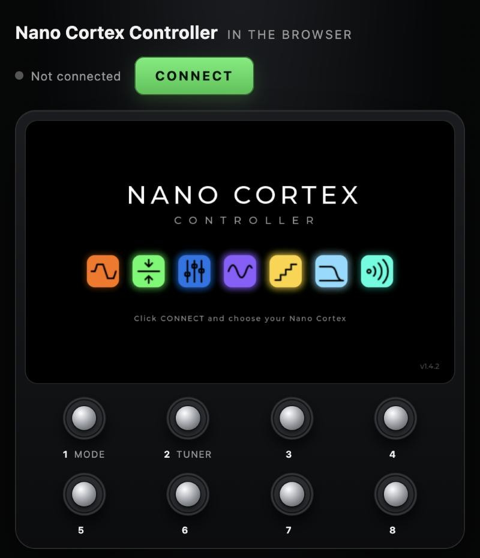

# Nano Cortex Controller Web (unofficial)

**Open it: https://drd85.github.io/nano-cortex-controller-web/**

The [Nano Cortex Controller](https://github.com/DrD85/nano-cortex-controller) in the browser – try it without
building the board. It is the controller's own firmware (the same screen and the same functions), compiled to
WebAssembly, with eight footswitch buttons below the screen and a Bluetooth connection to your **Neural DSP Nano
Cortex**.

> **Unofficial community project.** Not affiliated with, endorsed by or supported by Neural DSP.
> "Nano Cortex" and "Neural DSP" are trademarks of Neural DSP Technologies. The controller writes to your device.
> Use it at your own risk and keep backups of your presets (for example with the official Cortex Cloud app).

**Deutsch:** [weiter unten](#deutsch)

## What you need

- A **Nano Cortex** with Bluetooth on.
- **Chrome or Edge** on macOS, Windows, ChromeOS or Android (Web Bluetooth). Safari and Firefox do not support
  Web Bluetooth; on an iPhone or iPad use the **Bluefy** browser.

## Use it

1. Close other apps that use the Nano over Bluetooth (Cortex Cloud, the
   [Nano Cortex Editor](https://github.com/DrD85/nano-cortex-editor)) and switch off a controller board: the Nano
   takes one Bluetooth connection at a time.
2. Open the page, click **CONNECT** and choose your Nano Cortex. It also works offline: *Code → Download ZIP*,
   unzip and open `index.html` in Chrome or Edge.
3. The screen works like the touch screen: tap, hold, swipe. The eight footswitches below it work like the real ones:
   click, or hold for 0.6 s for their held function. The keys **1–8** press them too.

**On a phone**: turn it sideways and the page shows only the controller's screen, as large as possible, with a small
bar for connecting, full screen (where the browser allows it) and back. The display stays on while the Nano is
connected. **SCREEN** switches to the same view on a computer or tablet (or open the page with `?screen`); on a phone
held upright – or with rotation lock on – it turns the view by 90°, so hold the phone sideways.
On the iPhone use the **Bluefy** browser.

Everything the board does is there: presets and own banks, FX mode with the FX editor and FX presets, capture and
IR library, cab settings, capture tone and volume, tuner, the second effect on Pre FX 1, the reverb switch. See the
[controller's README](https://github.com/DrD85/nano-cortex-controller#using-it) for the details.

**Differences to the board**

- **MIDI**: the MIDI button lists the MIDI inputs of the computer (Web MIDI), for example a Morningstar MC6 over USB,
  and **Bluetooth MIDI device …** for a Bluetooth MIDI controller (MC6 / MC8 Pro, WIDI), connected directly as on the
  board – this also works on the iPhone (Bluefy), which has no Web MIDI. Same mapping as on the board.
- Own banks, symbols, FX presets and the footswitch order are stored in the browser (on this computer, in this
  browser only).
- No app bridge: the editor cannot connect through the page.

**Privacy**: the page runs entirely in your browser. It talks only to your Nano Cortex (Bluetooth) and, if you choose
one, to a MIDI input. Nothing is sent anywhere else.

## How it is made

The page is built from the controller's source: [`web/`](https://github.com/DrD85/nano-cortex-controller/tree/main/web)
replaces the board's hardware (display, touch, footswitches, Bluetooth, storage) with canvas, buttons, Web Bluetooth,
Web MIDI and localStorage; the screen and logic are the same C code as on the board, compiled with Emscripten.
This repository only holds the built page, served with GitHub Pages.

Licence: MIT ([LICENSE](LICENSE)). Built-in third-party software and fonts (LVGL, Montserrat, Font Awesome symbols):
[THIRD-PARTY.txt](THIRD-PARTY.txt).

---

## Deutsch

**Öffnen: https://drd85.github.io/nano-cortex-controller-web/**

Der [Nano Cortex Controller](https://github.com/DrD85/nano-cortex-controller) im Browser – zum Ausprobieren, ohne das
Board zu bauen. Es ist die Firmware des Controllers selbst (derselbe Bildschirm, dieselben Funktionen) mit acht
Fußschalter-Tasten unter dem Bildschirm, per Bluetooth mit deinem **Nano Cortex** verbunden.

**Du brauchst** einen Nano Cortex mit eingeschaltetem Bluetooth und **Chrome oder Edge** (macOS, Windows, ChromeOS,
Android). Safari und Firefox können kein Web Bluetooth; auf dem iPhone/iPad geht es mit dem Browser **Bluefy**.

**So geht's**

1. Andere Apps mit Bluetooth-Verbindung zum Nano schließen (Cortex Cloud, Nano Cortex Editor) und ein Controller-Board
   ausschalten – der Nano nimmt nur eine Bluetooth-Verbindung an.
2. Seite öffnen, **CONNECT** klicken und den Nano Cortex wählen. Geht auch offline: *Code → Download ZIP*,
   entpacken und `index.html` in Chrome oder Edge öffnen.
3. Der Bildschirm funktioniert wie der Touchscreen (tippen, halten, wischen). Die acht Fußschalter darunter wie die
   echten: klicken oder 0,6 s halten für die Haltefunktion. Die Tasten **1–8** drücken sie ebenfalls.

**Am Handy**: quer halten – dann zeigt die Seite nur den Controller-Bildschirm, so groß wie möglich, mit einer kleinen
Leiste für Verbinden, Vollbild (wo der Browser es erlaubt) und Zurück. Das Display bleibt an, solange der Nano
verbunden ist. **SCREEN** schaltet am Computer oder Tablet in dieselbe Ansicht; am Handy hochkant – oder mit
Ausrichtungssperre – dreht es die Ansicht um 90°, dann das Handy quer halten. Auf dem iPhone mit **Bluefy**.

**Unterschiede zum Board**: Der MIDI-Knopf zeigt die MIDI-Eingänge des Computers (z. B. ein MC6 per USB) und
**Bluetooth MIDI device …** für einen Bluetooth-MIDI-Controller (MC6/MC8 Pro, WIDI) – das geht auch am iPhone (Bluefy). Eigene
Bänke, Symbole, FX-Presets und die Fußschalter-Reihenfolge werden im Browser gespeichert. Die App-Brücke für den
Editor gibt es nicht.

**Datenschutz**: Die Seite läuft komplett im Browser und spricht nur mit deinem Nano (Bluetooth) und ggf. einem
MIDI-Eingang. Es wird nichts woandershin gesendet.

Inoffizielles Community-Projekt – nicht mit Neural DSP verbunden. Nutzung auf eigene Gefahr; sichere deine Presets
(z. B. mit der offiziellen Cortex-Cloud-App).
